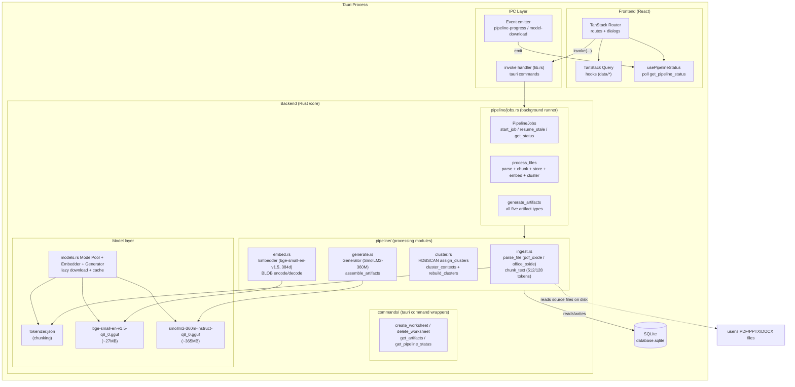

# Architecture Diagram

The entire application runs inside a single Tauri process. The React frontend
drives the Rust backend over async IPC; the backend owns document extraction,
embeddings, clustering, generation, job scheduling, and SQLite persistence.
There are no cloud dependencies.

## Moving parts

- **Frontend (React)** drives the pipeline via `invoke` on Tauri commands —
  creating a worksheet is the entire interaction — and renders live state by
  polling `get_pipeline_status` (`usePipelineStatus` in `app/data/pipeline.ts`).
- **commands/** is the thin IPC layer: each `#[tauri::command]` wrapper extracts
  `State` (database + models + jobs) and delegates to a plain-named core.
- **pipeline/jobs.rs** is the orchestration layer: `PipelineJobs` schedules one
  pipeline at a time (a tokio gate serializes inference), streams progress,
  persists `pipeline_status`, and re-runs stale jobs on startup
  (`resume_stale`). Heavy work is wrapped in `tauri::async_runtime::spawn_blocking`
  so the event loop stays responsive.
- **pipeline/ modules** are the pipeline stages. `ingest.rs` extracts + chunks
  text, `embed.rs` vectorizes, `cluster.rs` discovers topics, and `generate.rs`
  produces structured JSON.
- **Model layer** (`models.rs`) lazily downloads the three GGUF/tokenizer
  artifacts from Hugging Face on first use into the app data `models/` dir and
  caches the loaded models for the process lifetime. Both models share the
  single llama.cpp `LlamaBackend` created once in `models.rs`.
- **SQLite** is the single store: worksheets (with `pipeline_status`),
  files, chunks (with BLOB embeddings), clusters (centroids), and artifacts.