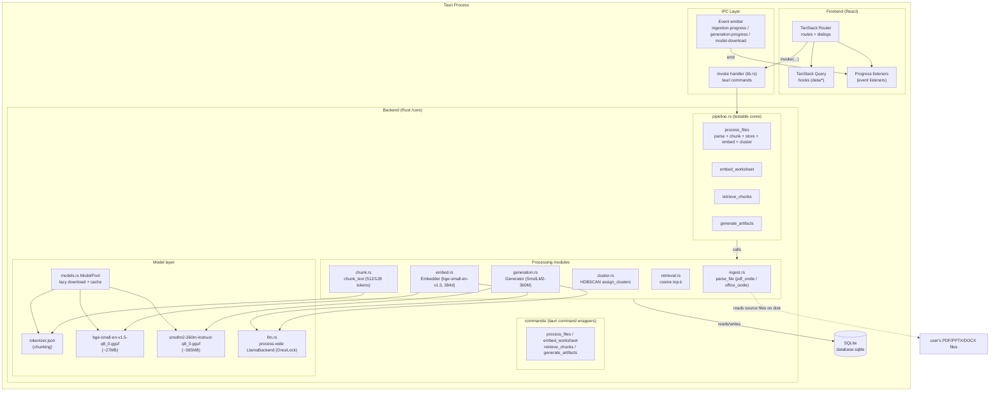

# Architecture Diagram

The entire application runs inside a single Tauri process. The React frontend
drives the Rust backend over async IPC; the backend owns document extraction,
embeddings, clustering, generation, and SQLite persistence. There are no cloud
dependencies.

## Moving parts

- **Frontend (React)** drives the pipeline via `invoke` on Tauri commands and
  renders live state from events (`usePipelineProgress` in `app/data/progress.ts`).
- **commands/** is the thin IPC layer: each `#[tauri::command]` wrapper extracts
  `State` (database + models) and delegates to a plain-named core.
- **pipeline.rs** is the orchestration layer: testable cores that take a pool
  and model pool directly (`core/src/pipeline.rs`). Heavy work is wrapped in
  `tauri::async_runtime::spawn_blocking` so the event loop stays responsive.
- **Processing modules** are the pipeline stages. `ingest.rs` extracts text,
  `chunk.rs` splits it, `embed.rs` vectorizes, `cluster.rs` discovers topics,
  `retrieval.rs` scores similarity, and `generation.rs` produces structured JSON.
- **Model layer** (`models.rs`) lazily downloads the three GGUF/tokenizer
  artifacts from Hugging Face on first use into the app data `models/` dir and
  caches the loaded models for the process lifetime. Both models share the
  single llama.cpp `LlamaBackend` created once in `llm.rs`.
- **SQLite** is the single store: worksheets, files, chunks (with BLOB
  embeddings), clusters (centroids), and artifacts.
