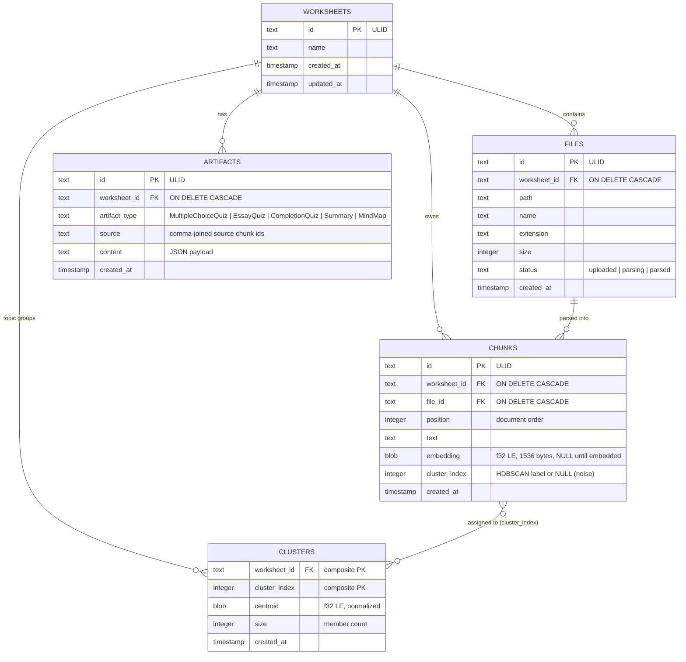

# Data Model (SQLite)

Entity-relationship model for the `database.sqlite` file. All IDs are ULIDs.
Embeddings are stored as little-endian float32 BLOBs (`384 × f32 = 1536` bytes
for bge-small) rather than in a vector database.

## Notes on the model

- **Cascades** delete a worksheet's files, chunks, clusters, and artifacts when
  the worksheet is removed (`ON DELETE CASCADE` on `worksheet_id`/`file_id`).
- **Indexes** (from migrations `20260419163341_schema.sql`,
  `20260630000001_pipeline.sql`, `20260811000000_clusters.sql`):
  - `idx_files_worksheet ON files(worksheet_id)`
  - `idx_chunks_worksheet ON chunks(worksheet_id)`
  - `idx_chunks_worksheet_position ON chunks(worksheet_id, position)`
  - `idx_artifacts_worksheet_type ON artifacts(worksheet_id, artifact_type)`
  - `idx_clusters_worksheet ON clusters(worksheet_id)`
- **Chunk ↔ Cluster** is many-to-many in spirit, but only the cluster side is
  persisted as a table (one centroid per cluster). Each chunk carries its
  cluster label denormalized in `chunks.cluster_index`, which the generation
  path uses to group units.
- **Embedding BLOBs** are decoded back to `Vec<f32>` by
  `retrieval.rs::bytes_to_embedding` for cosine retrieval and clustering; encoded
  by `embedding_to_bytes`. The cluster centroids are stored the same way and
  are L2-normalized.
