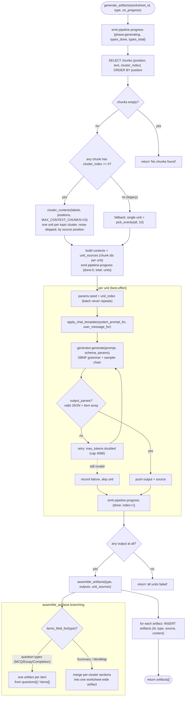

# Generation Pipeline

Zoom into `pipeline::generate_artifacts` (`core/src/pipeline/generate.rs`). This is where
RAG meets generation: it exhausts the material by producing one unit per HDBSCAN
topic cluster, generates grammar-constrained JSON per unit, then assembles and
persists artifacts. The LLM is `SmolLM2-360M-Instruct` (Q8_0, 8K context). It
runs as part of the automatic pipeline job for each of the five artifact types.

## The moving parts

1. **Fetch** — all chunks are read with their optional `cluster_index`. The
   auto-embed step runs before generation in `process_files`, so every chunk
   already has a vector.

2. **Unit selection** — `cluster_contexts` (`pipeline/cluster.rs`) groups chunks
   by cluster, orders clusters by the source position of their earliest chunk,
   and samples up to `MAX_CONTEXT_CHUNKS=10` members per cluster evenly by
   position. HDBSCAN noise (`cluster_index = -1`) is skipped. Legacy worksheets
   with no clusters fall back to a single unit spread evenly across the whole
   material.

3. **Prompt building** — `pipeline/generate.rs` provides a shared system prompt
   (`system_prompt_for`) and a per-type task prompt (`user_message_for`) that
   embeds the retrieved passages. The model's built-in chat template wraps the
   system + user messages (`apply_chat_template`).

4. **Grammar-constrained generation** — each unit's JSON schema (`schema_for`)
   is compiled into a GBNF grammar via `json_schema_to_grammar` and sampled
   under a chain `[grammar?, temp?, top_p, dist(seed)]`. The model can only emit
   schema-valid JSON. Sampling uses the apply-sampler path
   (`LlamaTokenDataArray::apply_sampler`) to avoid a known `sampler.sample`
   crash in llama-cpp-2.

5. **Best-effort retry** — if a unit's output truncates or fails to parse
   (`output_parses`), it is retried once with a doubled (capped 4096) token
   budget, then skipped so one bad cluster never discards an otherwise healthy
   batch.

6. **Artifact assembly** — `assemble_artifacts` branches on artifact type:
   - **Question types** (`MultipleChoiceQuiz`, `EssayQuiz`, `CompletionQuiz`):
     each unit's item array (`questions[]` / `items[]`) is split so every item
     becomes its own persisted artifact.
   - **Summary / MindMap**: every unit's section is merged into a single
     worksheet-wide artifact, ordered by source position, with a shared
     title/topic.

7. **Persist** — each artifact (new ULID id, type, comma-joined source chunk
   ids, JSON content) is inserted into the `artifacts` table and returned to the
   frontend. `pipeline-progress` is emitted once per unit plus a per-type reset
   at the start of each artifact type.

## Sampling parameters (`GenerationParams`, defaults)

| Param | Default | Notes |
|-------|---------|-------|
| `temperature` | 0.7 | skipped from sampler chain when `<= 0` |
| `top_p` | 0.9 | |
| `max_tokens` | 1024 | capped by `N_CTX(8192) - prompt_tokens - 1` |
| `seed` | 1234 | + unit index per unit to avoid batch repetition |

Context window `N_CTX = 8192`; max prompt `MAX_PROMPT_TOKENS = 6144`.
