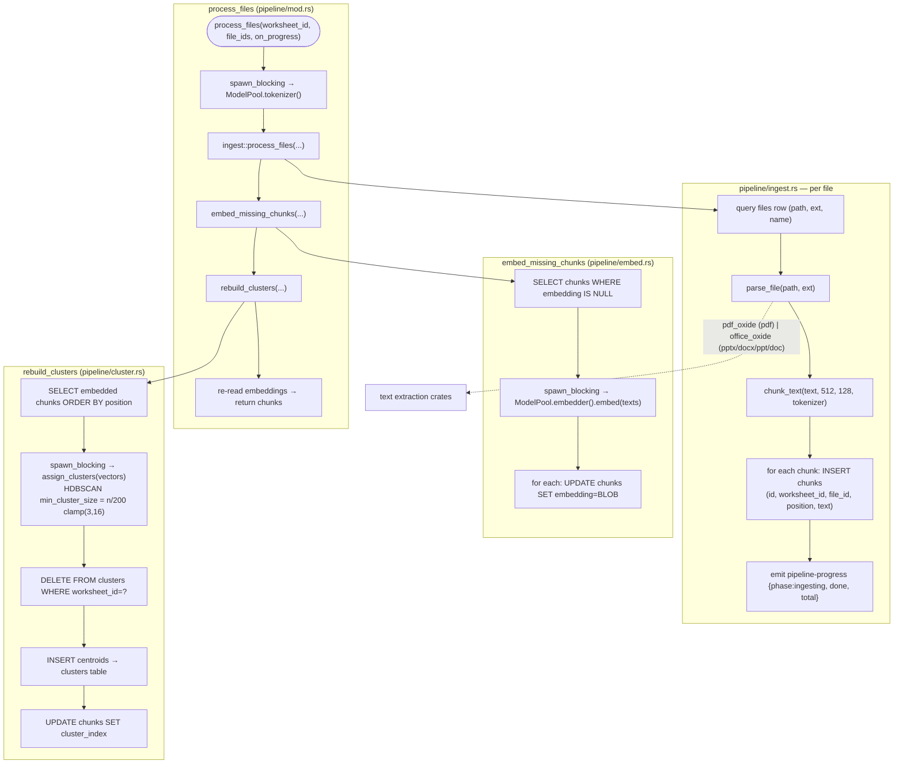

# Ingestion Pipeline

Zoom into the ingest path driven by `pipeline::process_files` (`core/src/pipeline/mod.rs`)
and `pipeline/ingest.rs`. This phase produces persisted, embedded,
topic-clustered chunks — the input to generation. It runs inside the automatic
pipeline job started by `create_worksheet`.

## The moving parts

1. **Tokenizer** — `process_files` grabs the HF `tokenizers` tokenizer from
   the `ModelPool` (downloaded lazily) and passes it to the ingest loop. Only
   the ~2MB `tokenizer.json` is needed for chunking, so it is fetched
   independently of the models.

2. **Parse** — `pipeline/ingest.rs::parse_file` dispatches on extension:
   - `pdf` → `pdf_oxide`, page-by-page `extract_text_auto`
   - `pptx | docx | ppt | doc` → `office_oxide::extract_text`
   - anything else → error (unsupported)

3. **Chunk** — `pipeline/ingest.rs::chunk_text` tokenizes the whole document,
   then slides a window of `chunk_size=512` tokens with `overlap=128`, decoding
   each window back to text. Overlap is clamped to `chunk_size/2`. Short docs
   return as one chunk.

4. **Store** — each chunk is inserted with a global `position` counter (in
   document order across files), its worksheet and file ids, and `embedding=NULL`.

5. **Embed** — `pipeline/embed.rs::embed_missing_chunks` selects every chunk
   still missing a vector, embeds them in one `spawn_blocking` call via the
   bge-small embedder (384-dim, L2-normalized), and writes each vector back as
   a little-endian float32 BLOB (`embedding_to_bytes`).

6. **Cluster** — `pipeline/cluster.rs::rebuild_clusters` runs HDBSCAN over all
   embedded chunks (`assign_clusters`), persists one centroid per topic cluster
   into the `clusters` table, and writes each chunk's `cluster_index` (or NULL
   for noise). `min_cluster_size` scales as `n/200` clamped to `[3,16]`; tiny
   worksheets fall back to a single cluster.
