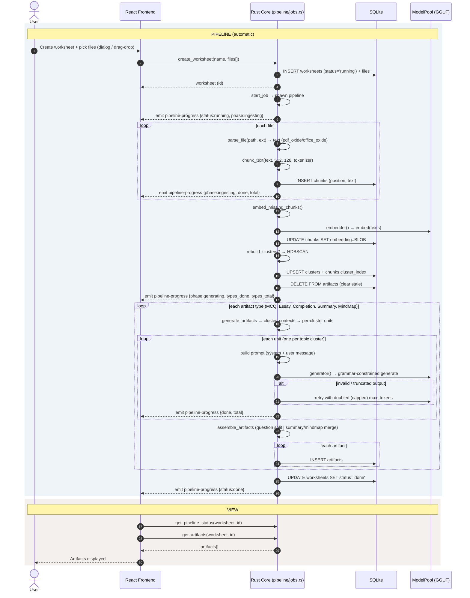

# End-to-End Sequence

The user journey through the RAG pipeline. Creating a worksheet kicks off an
automatic background job that runs ingest → embed → cluster → generate with no
further user action. The frontend column is the React UI; the backend column is
the Rust core invoked over Tauri IPC. Progress is streamed back through a single
`pipeline-progress` event and polled via `get_pipeline_status`.

## Interaction stages captured from the frontend

- **File selection**: `FilesUploader` (`app/components/files-uploader.tsx`) uses
  the Tauri dialog plugin (`open` with a document filter) and drag-and-drop
  (`TauriEvent.DRAG_DROP`), filtering to `SUPPORTED_EXTENSIONS`.
- **Worksheet creation**: `CreateWorksheetDialog`
  (`app/components/create-worksheet-dialog.tsx`) collects a name + file paths,
  calls `create_worksheet` (which starts the pipeline job), then navigates to
  `/worksheets/$id`.
- **Progress**: `usePipelineStatus` (`app/data/pipeline.ts`) polls
  `get_pipeline_status` every ~1.2s while the status is `running` and renders
  the phase (`ingesting`/`generating`), file/unit counts, and per-type progress.
- **Artifacts**: `ArtifactsPanel` (`app/components/workspace/artifacts-panel.tsx`)
  lists and filters artifact cards; `get_artifacts` populates them once the job
  finishes.