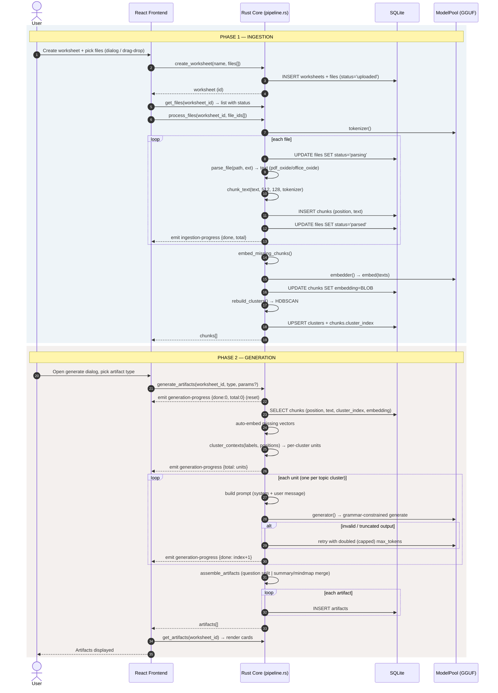

# End-to-End Sequence

The user journey through the RAG pipeline, split into the **ingest** phase and
the **generate** phase. The frontend column is the React UI; the backend column
is the Rust core invoked over Tauri IPC. Progress is streamed back through
emitted events while the command is still running.

## Interaction stages captured from the frontend

- **File selection**: `FilesUploader` (`app/components/files-uploader.tsx`) uses
  the Tauri dialog plugin (`open` with a document filter) and drag-and-drop
  (`TauriEvent.DRAG_DROP`), filtering to `SUPPORTED_EXTENSIONS`.
- **Worksheet creation**: `CreateWorksheetDialog`
  (`app/components/create-worksheet-dialog.tsx`) collects a name + file paths and
  calls `create_worksheet`, then navigates to `/worksheets/$id`.
- **Processing**: `FilesPanel` (`app/components/workspace/files-panel.tsx`)
  invokes `process_files` on un-parsed files and renders
  `ingestion-progress` + `model-download` progress bars.
- **Generation**: `GenerateDialog` (`app/components/workspace/generate-dialog.tsx`)
  picks an artifact type and optional advanced sampling params, invokes
  `generate_artifacts`, and renders `generation-progress` while busy.
- **Artifacts**: `ArtifactsPanel` (`app/components/workspace/artifacts-panel.tsx`)
  lists and filters artifact cards; `get_artifacts` populates them.

All hooks live in `app/data/*` (`files.tsx`, `artifacts.tsx`, `progress.ts`,
`model-downloads.ts`).
